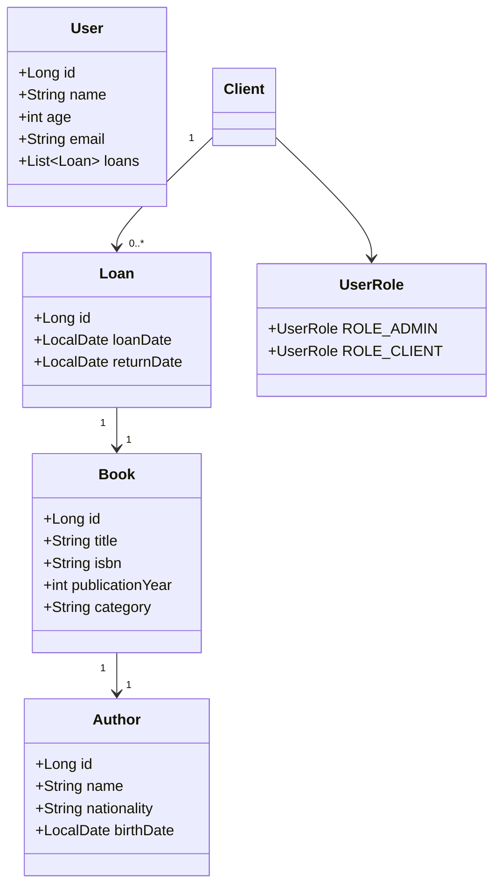

## Class Diagram

```mermaid
classDiagram
    class User {
        +Long id
        +String name
        +int age
        +String email
        +List~Loan~ loans
    }

    class Loan {
        +Long id
        +LocalDate loanDate
        +LocalDate returnDate
    }

    class Book {
        +Long id
        +String title
        +String isbn
        +int publicationYear
        +String category
    }

    class Author {
        +Long id
        +String name
        +String nationality
        +LocalDate birthDate
    }

    class UserRole {
        +UserRole ROLE_ADMIN
        +UserRole ROLE_CLIENT
    }

    %% Relationships
    Client "1" --> "0..*" Loan
    Loan "1" --> "1" Book
    Book "1" --> "1" Author
    Client --> UserRole

```
